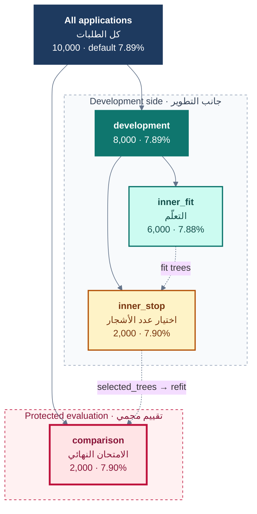

```mermaid
%%{init: {'theme':'base', 'themeVariables': {'fontFamily':'Segoe UI, Tahoma, sans-serif', 'fontSize':'15px', 'lineColor':'#64748B'}}}%%
flowchart TD
    ALL["<b>All applications</b><br/>كل الطلبات<br/>10,000 · default 7.89%"]

    subgraph DEVBOX["Development side · جانب التطوير"]
        DEV["<b>development</b><br/>8,000 · 7.89%"]
        FIT["<b>inner_fit</b><br/>التعلّم<br/>6,000 · 7.88%"]
        STOP["<b>inner_stop</b><br/>اختيار عدد الأشجار<br/>2,000 · 7.90%"]
    end

    subgraph EVALBOX["Protected evaluation · تقييم محمي"]
        CMP["<b>comparison</b><br/>الامتحان النهائي<br/>2,000 · 7.90%"]
    end

    ALL --> DEV
    ALL --> CMP
    DEV --> FIT
    DEV --> STOP
    FIT -. "fit trees" .-> STOP
    STOP -. "selected_trees → refit" .-> CMP

    classDef total fill:#1E3A5F,stroke:#1E3A5F,color:#FFFFFF
    classDef dev   fill:#0F766E,stroke:#0F766E,color:#FFFFFF
    classDef fit   fill:#CCFBF1,stroke:#0F766E,color:#134E4A,stroke-width:2px
    classDef stop  fill:#FEF3C7,stroke:#B45309,color:#78350F,stroke-width:2px
    classDef eval  fill:#FFE4E6,stroke:#BE123C,color:#881337,stroke-width:3px

    class ALL total
    class DEV dev
    class FIT fit
    class STOP stop
    class CMP eval

    style DEVBOX  fill:#F8FAFC,stroke:#94A3B8,stroke-dasharray:4 4,color:#334155
    style EVALBOX fill:#FFF1F2,stroke:#BE123C,stroke-dasharray:4 4,color:#881337
```
